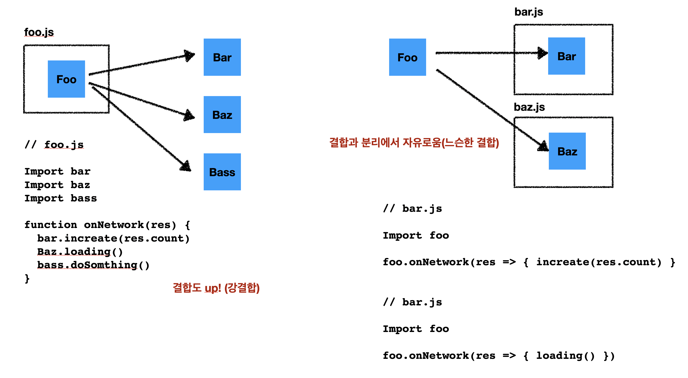

[프로그래밍 패러다임과 반응형 프로그래밍 그리고 Rx](https://velog.io/@teo/reactive-programming#패러다임의-전환-2---변경사항의-전파pull-→-push)

## what is reactive programming

반응형 프로그래밍이랑, **데이터의 흐름**과 **변경사항의 전파**에 중점을 둔 **선언적 프로그래밍**이다

### 프로그래밍에서 패러다임

-   프로그래밍의 관점을 갖게 해주고 결정한다
-   객체지향: 프로그램을 상호작용하는 객체들의 집합으로 본다
-   함수형: 프로그램을 상태값을 지니지 않는 함수값들의 연속으로 생각한다

## 반응형 프로그래밍 패러다임이란

-   데이터의 흐름
-   변경사항의 전파

```html
a = 1, b = 2, c = a+b , d = c + 3
```

-   위 수식에서 값 c는 값 a와 b에 의존하고 있다
-   값 a가 변하는 경우
    -   값 c도 변한다 (**변경사항의 전파**)
    -   변경된 c의 값이 d에도 반영된다 (**데이터의 흐름**)

## 웹 프레임워크

웹 프레임워크의 가장 중요한 특징은 아래와 같다

-   선언적 프로그래밍 가능
-   MVVM

> **MVVM**
> change detection + binding + template + auto rerender = reactive
> 즉 **상태가 변경**되면 **이를 감지**해 **템플릿**에 선언된대로 **리랜더링** 해준다

## 패러다임 전환#1 선언적 프로그래밍

명령형: 일일히 DOM을 어떻게 조작할지 명시

선언형: DOM이 어떤 형태일지 jsx혹은 template binding을 통해 명시적으로 작성

### 선언적 프로그래밍의 장점

-   가독성
-   재사용성
-   독립성
-   유지보수성

## 패러다임 전환#2 변경사항의 전파

Pull에서 Push로 변화

### pull

-   랜더링 해야하는 시점에 데이터를 불러온다

### push

-   상태가 변할 때마다 템플릿으로 데이터 전달

처음 반응형 프로그래밍이 등장할 때 뷰 랜더링 영역에서 주로 사용되었다. 하지만 이제 이를 넘어 비즈니스 로직을 포함한 모든 스크립트에 사용되고 있다.

Redux를 필두로한 상태관리 역시 데이터의 변경을 감지하고 변경을 전파하고 선언적으로 값을 생성하는 반응형 프로그래밍에 포함된다

## 비동기 프로그래밍과 반응형 프로그래밍

프론트에서 반응형 프로그래밍을 하는 이유는 **비동기 프로그래밍**을 잘하기 위해서이다.

비동기 프로그래밍은 상당히 어렵다. 프론트엔드 대부분의 로직이 비동기로 동작한다

### 비동기 프로그래밍이 어려운 이유

1. 작성 순서대로 동작하지 않는다
2. 호출 순서대로 동작하지 않는다
3. 언제 실행될지 예측할 수 없다
4. 호출 당시의 값과 실행 당시의 값이 같다는 것을 보장할 수 없다

JS에서는 비동기 프로그래밍을 위한 `Promise`, `async-await`과 같은 구문들이 존재한다. 하지만 복잡한 형태의 서비스를 개발하기는 아주 힘들어진다

프론트엔드는 `서버 비동기 동작`과, `사용자 비동기 동작`이 혼재해 있다.

## 반응형 프로그래밍 Deep dive

반응형 프로그래밍은 변경을 감지하고 전파하고 선언적으로 코드를 작성하는 방식이다.


익숙한 `addEventListener`도 이러한 구조를 갖고 있다.

반응형 프로그래밍이 가고자 하는 방향도 이와 비슷하다



-   foo는 다른 모듈의 동작을 몰라도 된다 (역할과 책임)
    -   foo모듈은 다른 모듈에게 데이터를 어떻게 전달해야할지 알 필요가 없다
    -   그저 데이터가 생성되는 시점에 전달만 하면 된다
    -   캡슐화
    -   느슨한 결합
    -   하나의 모듈에서 하나의 화살표만 처리한다
    -   제어의 역전
    -   pull → push
    -   event 리스닝

변경사항의 전파 + 데이터 흐름 = 이벤트

이벤트 + 선언적 프로그래밍 = 반응형 프로그래밍
